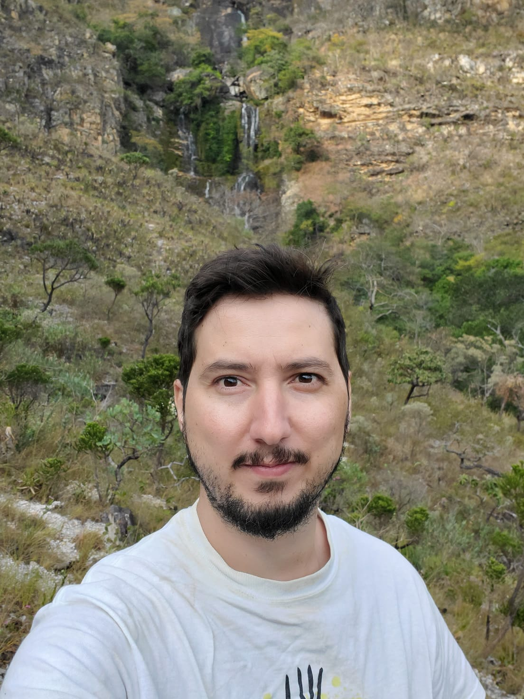

 

I was born and raised in Belo Horizonte - MG, a big city on the mountains that divide two main biomes in Brazil, Atlantic Forest and Cerrado. I went to Universidade Federal de Minas Gerais for my undergrad and grad studies. I earned my B.S. in Biology, emphasis in Zoology, in 2009, my M.S. in Ecology, conservation and wildlife management in 2012 and my Ph.D. in Zoology in 2016. During my PhD I spent one year at the California Academy of Sciences in San Francisco. I lived in Buenos Aires, Argentina, for two years working as a postdoctoral researcher at Museo Argentino de Ciencias Naturales, and moved to San Diego, CA for a four-year postdoc at San Diego State University. I am now based in Ithaca, NY. Besides studying, teaching and talking about spiders, I enjoy hiking, outdoor activities, wlaking and playing with my dog, and music related stuff (concerts, playing guitar and bass guitar, listening to vinyl records, etc...) 

