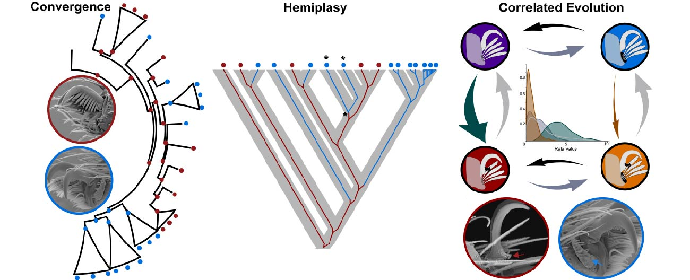
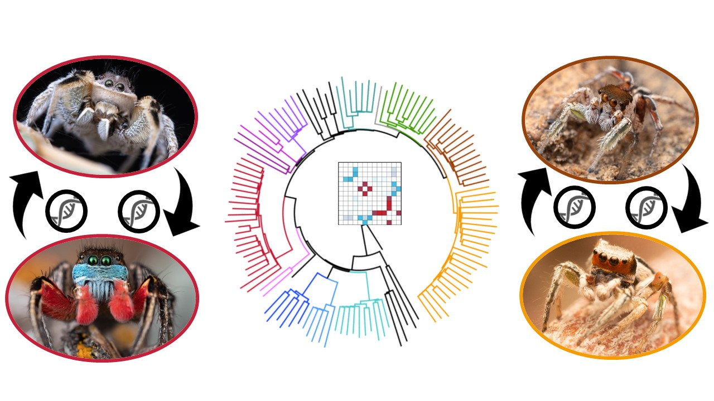
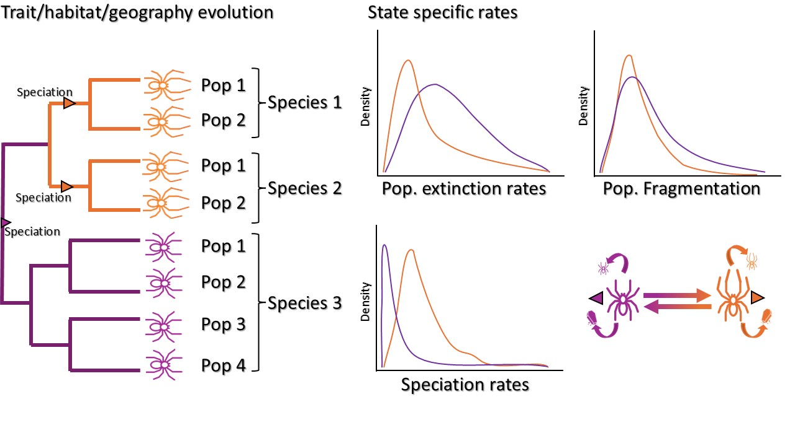

My research aims to reveal patterns and processes underlying the diversity and distribution of organisms across scales. By using, adapting and developing analytical tools that connect micro- and macro-evolutionary aspects of evolution, I combine concepts and theories from disciplines, such as population genetics, phylogenetics, ecology and biogeography. More specifically, I am interested in (1) using population level processes informed by genomic data to better understand phenotypic evolution; (2) understanding the role of sexual selection and introgression on speciation and the evolution of sex related traits; (3) studying how genome, phenotype, geography and environment interact with each other to generate and maintain biodiversity; and (4) how anthropogenic induced changes impact genetic and taxonomic diversity. Click on the images to know more!.

## Phenotypic evolution through the lens of population genetics processes

 
 In addition to providing more robust phylogenetic hypotheses, phylogenomic studies also bring insighabout how molecular evolution and population genetics processes are linked to phenotypic evolution and systematics. For instance, whancestral population sizes are ignored, the analyses of phenotypic evolution can mislead conclusions about processes, such as mistakiconvergence from drift or balancing selection deep in the past. Despite its importance, the connection between molecular and phenotypevolution is rarely considered in trait evolution studies. My research investigate how population genetics theory informed by genomic dais linked to trait evolution in spiders. The foundations for this research come from my previous works, where I found that phenotyprelated to web-less lifestyle in spiders could be mistaken as convergent evolution when in fact it is likely to be a homologous traresultant from population process in the past (hemiplasy). I also developed a novel bioinformatic pipeline that combines coalescent adiscrete trait evolution models for studying the probability of hemiplasy. The combined use of phenotypes and genomics with approachthat better link molecular and morphological evolution can help us to elucidate phylogenetic relationships and better test evolutionaprocesses.

 

 Fig. 1. Population genetic processes can provide valuable information for understanding trait evolution. 

## Introgression, speciation and evolution of sexual traits

 
 Exaggerated and distinct sexual traits are usually seen as indicative of genetic isolation and species identity. Nevertheless, recent studies have shown that gene flow across species (introgression) with marked differences on sex related traits can be more common than previously thought. My lab will investigate the patterns and process of gene flow between species with different genitalia, ornaments and mating behavior.  My ongoing research on paradise jumping spiders (Habronattus) provides the basis for continuing and expanding this research program. Using transcriptome and genomic scale data, I have been finding strong signs of introgression and hybridization between species with extremely different sex signaling and sexual traits morphology. I also found that introgression might be creating new morphotypes and ecotypes, allowing species to explore new environments. I am building upon the vast data and results from these studies to further deepen and expand the research on introgression between species with different mating traits to understand how sexual selection might be promoting introgression and diversification, and to detect the genes involved in gene flow and speciation. 

 
 
Fig. 2. Contrary to previously though, species with very different sexual traits may have strong signs of introgression. 

##  Genes, phenotypes, geography and the environment 

 The interactions between genes, phenotype, geography and environment determine the fate of the organisms during their evolutionary path. It is the goal of Biogeography and Phylogeography to untangle those interactions to understand processes underlying the taxonomical and genetic diversity. While Biogeography deals with broader phylogenetic, geographic and ecological scales and Phylogeography is usually focused on recent divergences in smaller ecological regions, efforts to unite methods used in both fields may yield a comprehensive view of species evolution. My research investigates the Biogeography and Phylogeography of spiders, not only as separate disciplines but integrating the micro and macro scales of both fields. My previous research found that the microCT scan of a fossil species suggested an overlooked biogeographical hypothesis for crevice dweller spiders, and that model testing unraveled how and when a group of jumping spiders arrived at the pacific islands. I am currently investigating the effects of Sky islands dynamics on the genetic and signaling diversity of *Habronattus*, as well as using geometric morphometrics of genitalia to test the influence of geography on speciation of wondering spiders. In addition, I am developing a new protracted speciation model to account for trait influence on population fragmentation, extinction and speciation. 

 
 
Fig. 3. A protracted speciation combines micro and macroevolutionary processes to test effect of traits, habitat or geography on the distinct diversification rates. 
