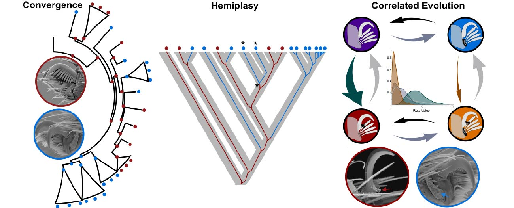

# Research

## Phenotypic evolution through the lens of population genetics processes

 
 In addition to providing more robust phylogenetic hypotheses, phylogenomic studies also bring insighabout how molecular evolution and population genetics processes are linked to phenotypic evolution and systematics. For instance, whancestral population sizes are ignored, the analyses of phenotypic evolution can mislead conclusions about processes, such as mistakiconvergence from drift or balancing selection deep in the past. Despite its importance, the connection between molecular and phenotypevolution is rarely considered in trait evolution studies. My research investigate how population genetics theory informed by genomic dais linked to trait evolution in spiders. The foundations for this research come from my previous works, where I found that phenotyprelated to web-less lifestyle in spiders could be mistaken as convergent evolution when in fact it is likely to be a homologous traresultant from population process in the past (hemiplasy). I also developed a novel bioinformatic pipeline that combines coalescent adiscrete trait evolution models for studying the probability of hemiplasy. The combined use of phenotypes and genomics with approachthat better link molecular and morphological evolution can help us to elucidate phylogenetic relationships and better test evolutionaprocesses.

 

 ## Other research

 
 In addition to providing more robust phylogenetic hypotheses, phylogenomic studies also bring insighabout how molecular evolution and population genetics processes are linked to phenotypic evolution and systematics. For instance, whancestral population sizes are ignored, the analyses of phenotypic evolution can mislead conclusions about processes, such as mistakiconvergence from drift or balancing selection deep in the past. Despite its importance, the connection between molecular and phenotypevolution is rarely considered in trait evolution studies. My research investigate how population genetics theory informed by genomic dais linked to trait evolution in spiders. The foundations for this research come from my previous works, where I found that phenotyprelated to web-less lifestyle in spiders could be mistaken as convergent evolution when in fact it is likely to be a homologous traresultant from population process in the past (hemiplasy). I also developed a novel bioinformatic pipeline that combines coalescent adiscrete trait evolution models for studying the probability of hemiplasy. The combined use of phenotypes and genomics with approachthat better link molecular and morphological evolution can help us to elucidate phylogenetic relationships and better test evolutionaprocesses.

 